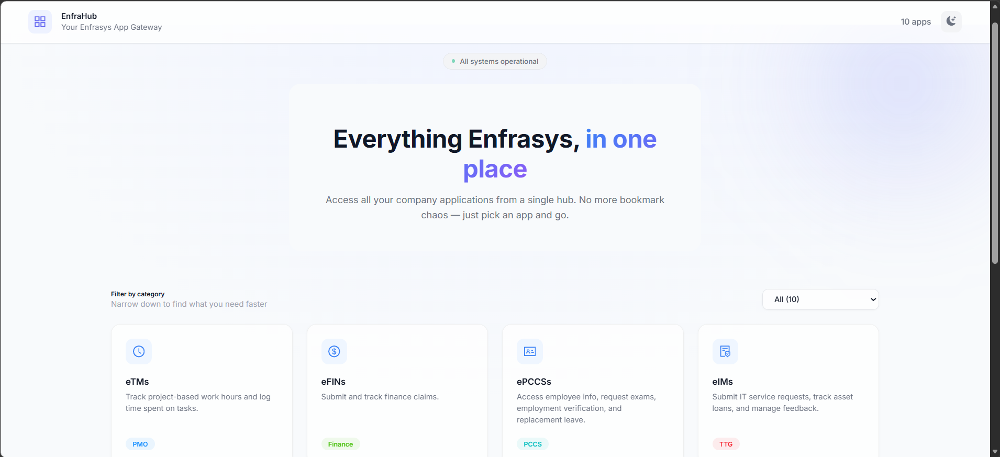
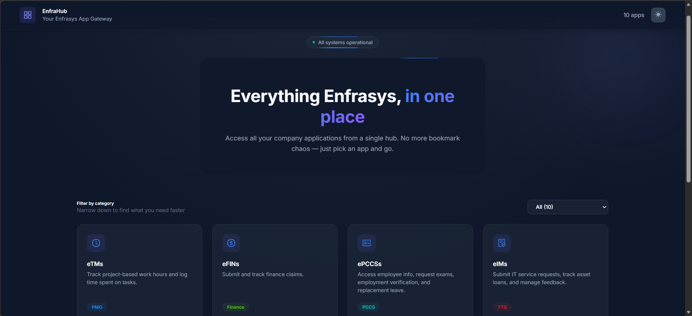

# 🏢 EnfraHub

Everything Enfrasys, in one place. An enterprise centralized application portal built with React and Vite that acts as a single hub for all Enfrasys company applications. It also features an embedded HR Assistant powered by Microsoft Foundry AI, designed to answer company policy questions.

> **Note on AI Agent:** The Agentic AI is designed to use RAG (Retrieval-Augmented Generation) via Azure AI Search to ground its answers using the internal `hr-documents` (Employee Handbook, Memorandums, etc.). However, this capability is currently **disabled/commented out** to save costs on the continuously running Azure AI Search resource.

## 📖 Overview

EnfraHub provides a complete, modern web application that acts as a single access point for all internal tools at Enfrasys. Employees can easily find and launch applications categorized by departments such as PMO, Finance, PCCS, TTG, Procurement, and Compliance. 

Additionally, the portal includes a floating ChatBot (EnfraHub HR Assistant). This agent communicates with an Express backend that orchestrates calls to a **Microsoft Foundry** agent (`hr-agent`). When the RAG pipeline is active, it grounds its answers in the actual HR policies and memorandums stored in the company's document repository.

## ✨ Key Features

- **Centralized App Hub (Redirect Links):** Access internal apps like eTMs, eFINs, ePCCSs, eIMs, eIRFs, Whistleblowing forms, and the Leave Calendar from a single categorized interface. Clicking an application card acts as a quick redirect link to the respective external platform (PowerApps, Power BI, SharePoint, Microsoft Forms, etc.). No more bookmark chaos.
- **Embedded HR Assistant:** A built-in chat interface to ask questions regarding HR policies, employee benefits, and company announcements.
- **RAG-Powered Grounding (Disabled for Cost Optimization):** When active, the agent uses Azure AI Search to retrieve context from the `hr-documents` directory (e.g., Employee Handbook, Memorandums).
- **Responsive Modern UI:** Built with React, Vite, Ant Design, and Bootstrap. Features a polished UI with rotating loading phrases, dark mode support, and interactive animations.
- **Secure AI Backend:** An Express.js server uses the `@azure/ai-projects` SDK and `@azure/identity` (`DefaultAzureCredential`) for secure, keyless authentication to Microsoft Foundry.

## 📸 Screenshots

*Create a folder named `media/screenshots/` in your repository and place your screenshot images there to display them here.*

| Light Mode | Dark Mode |
| :---: | :---: |
|  |  |

## 🏗️ Architecture

```text
User → Vite/React App (EnfraHub UI)
            ├── External App Links (PowerApps, PowerBI, Forms, SharePoint)
            └── /api/chat → Express Backend (server.js)
                                └── Microsoft Foundry Agent (hr-agent)
                                      └── [Disabled] Azure AI Search (RAG over hr-documents)
```

## 🗄️ Grounding Documents

The `hr-documents` directory contains the source-of-truth files used by the AI Agent for its RAG capabilities:
- **Employee Handbook**
- **Enfrasys Operations Chart**
- **Company Memorandums:**
  - Festival Early Release & Early Payroll Arrangements
  - Employee Benefits Enhancement
  - Introduction of PERKESO Skim Kemalangan Bukan Bencana Kerja

## 💻 Tech Stack

- **Frontend:** React, Vite, JavaScript
- **UI Components:** Ant Design (antd), Bootstrap 5, Bootstrap Icons
- **Backend API:** Express.js, Node.js, CORS
- **AI Orchestration:** Microsoft Foundry (`@azure/ai-projects` SDK)
- **Identity & Auth:** `@azure/identity`
- **Markdown Rendering:** `react-markdown` with `remark-gfm`

## 📋 Prerequisites

Before setting up the project locally, ensure you have the following:

- [Node.js](https://nodejs.org/en/) (v18 or higher)
- [Azure CLI](https://learn.microsoft.com/en-us/cli/azure/install-azure-cli) (for local Azure authentication)
- An active Azure Subscription with a **Microsoft Foundry** project and a published agent (`hr-agent`).

### Required roles and access

- Developers and the backend identity need at least the **Foundry User** Azure RBAC role on the Foundry resource to invoke the agent.

## ⚙️ Environment Variables

Create a `.env.local` file in the `enfrahub-ui` directory and configure the following variables:

```env
# Microsoft Foundry Settings
FOUNDRY_PROJECT_ENDPOINT="https://<your-resource-name>.services.ai.azure.com/api/projects/<your-project-name>"

# Agent reference in "name" and "version" format
AZURE_OPENAI_AGENT_ID="hr-agent"
AZURE_OPENAI_AGENT_VERSION="3"

# Express Server Port (Optional, defaults to 3001)
PORT=3001
```

*Note: Authentication uses `DefaultAzureCredential`. Locally this resolves to your Azure CLI login. No API keys are required in the environment variables.*

## 🚀 Local Setup

**1. Clone the repository and navigate to the UI folder:**
```cmd
git clone <your-repository-url>
cd internal-enfrahub-project/enfrahub-ui
```

**2. Install dependencies:**
```cmd
npm install
```

**3. Authenticate with Azure CLI:**
Log in to the Azure CLI using an account that has access to the Foundry project.
```cmd
az login
```

**4. Run the development server:**
This will concurrently start the Vite frontend and the Express backend.
```cmd
npm run dev
```

**5. Access the application:**
Open [http://localhost:5173](http://localhost:5173) (or the port Vite assigns) in your web browser.

## ☁️ Deployment

When preparing for deployment, the application is built using Vite, and the Express server serves the static files from the `dist` folder.

**1. Build the frontend:**
```cmd
npm run build
```

**2. Run the production server:**
```cmd
npm run start
```
The Express server (`server.js`) will automatically serve the built static assets from the `dist` directory and handle `/api/chat` requests. Ensure environment variables are properly configured in your hosting environment (e.g., Azure Web Apps) and that the hosting resource's Managed Identity has the necessary permissions in Microsoft Foundry.

## 🖱️ Usage Guide

**1. Navigate Applications**
Use the category dropdown on the home page to filter applications by department (PMO, Finance, PCCS, TTG, Procurement, Compliance).

**2. Launch an Application**
Click on any application card (e.g., eTMs, eFINs) to be redirected to its external link in a new tab. *(Note: These are quick redirect links to their original host platforms, not embedded applications).*

**3. Ask the HR Assistant**
Click the floating chat button in the bottom-right corner to open the EnfraHub HR Assistant. Type your HR-related questions. The chat will show rotating thinking phrases while waiting for the Foundry agent to respond. 

*(Note: Grounded answers will not include details from the `hr-documents` while the RAG functionality is disabled.)*

---

<div align="center">
  <em>Developed by <strong>Muhammad Idzhans Khairi</strong> for <strong>Enfrasys Solutions Sdn Bhd</strong></em>
</div>
